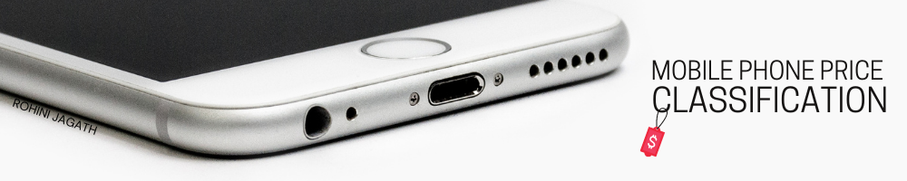

# Mobile Phone Classification

Mobile phones are one of the most used and widley available tech products worldwide. Approximately 67% of the world's population (5.2 billion people) uses or has access to a mobile phone. These phones range from high tech smart phones with the most advanced technologies and functionalities built in, such as cameras, large displays, and sleek sophisticated designs, to feature phones, which retains the form factor of earlier-generation phones, with button-based input and small displays. 

Every phone has a set of features and technical specifications. Can we predict the price range that a phone would fall into based on it's availbale features? The data used in this notebook is freely available on [Kaggle.](https://www.kaggle.com/iabhishekofficial/mobile-price-classification)

# Uses
Assist mobile phone manufacturers or sellers in determining competitive price ranges for products, determine if consumers are being overcharged or undercharged.

# Prerequisites
- Programming fundamentals and the basics of the Python programming language (Python 3.x), Numpy, Pandas, Matplotlib, Seaborn
- Fundamentals of Supervised Learning: Classification
- [Scikit-learn](https://scikit-learn.org/)

# Key Insights
- The price range of a mobile phones in the dataset can be determined with high confidence.
- The most influential feature that determined price is the RAM of the phone.

# Machine Learning & Prediction of Listing Price
- From the confusion matrices we observe that SVC and Logistic Regression perform similarly in classifying Class 0 and 3.
- As theorised, Class 1 and 2 are a bit harder to classify as there is more overlap with the most significant feature, RAM. - Class 1 and 2 have more misclassified observations for all models.
- SVC has a lower number of misclassifications for these classes overall, and would therefore be the selected model.
